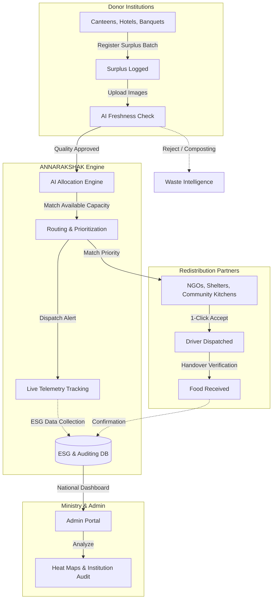

# ANNARAKSHAK 🛡️

**India's Centralized AI Food Rescue & Redistribution Network**

---

## 📖 Introduction

**ANNARAKSHAK** is a next-generation platform designed to bridge the gap between food surplus and food insecurity. Every year, millions of tonnes of perfectly good food are wasted at banquets, hotels, and canteens, while millions of citizens require essential nutrition. 

By leveraging **AI-driven freshness evaluation**, **intelligent allocation routing**, and **real-time dispatch telemetry**, ANNARAKSHAK directly connects donor institutions with verified redistribution partners. It is built as a commercial-grade, multi-tenant ecosystem prioritizing transparency, ESG tracking, and rapid response to ensure food is rescued well within its safe consumption window.

**Core Values:**
- **Automated Intelligence:** Zero-hardware AI estimation of food condition and capacity matching.
- **Unified Visibility:** Dedicated interfaces for Donors, Redistribution Partners, and Governance bodies.
- **Traceability:** Live GPS transit tracking and strict ESG compliance reporting.

---

## 🏗️ System Architecture / Flowchart



---

## 📸 Screenshots

### 1. Donor Institution: Item Registration

*A streamlined interface for donor institutions to log surplus food batches.*

### 2. Donor Institution: Live Tracking

*Real-time GPS tracking and dispatch telemetry for outbound surplus food.*

### 3. Redistribution Partner: Incoming Food

*Redistribution partners receive high-priority matches with 1-click acceptance capabilities.*

### 4. Redistribution Partner: Track Delivery

*Live capacity tracking and driver coordination for incoming food deliveries.*

### 5. National Admin: Institution Dashboard

*High-level administrative oversight for civil supplies and ESG certification auditors.*

---

## 🚀 Setup Guide

Follow these steps to configure, build, and run ANNARAKSHAK locally on your machine.

### Prerequisites
- **Node.js** (v18+ recommended) for the frontend.
- **Python** (v3.10+ recommended) for the backend.
- **Git** for version control.
- **Pipenv** or standard `venv` for Python package management.

### 1. Clone the Repository
```bash
git clone https://github.com/TeamDireWolf/Annarakshak.git
cd Annarakshak
```

### 2. Run with Docker (Recommended)
If you have Docker and Docker Compose installed, you can spin up the entire stack with a single command:

```bash
docker-compose up --build
```
*The frontend will be available at `http://localhost:5173` and the backend at `http://localhost:8000`.*

---
### 3. Manual Setup (Alternative)

#### Backend Setup
Navigate to the backend directory, install dependencies, and start the FastAPI server.

```bash
cd backend

# Create a virtual environment and activate it
python -m venv venv
# On Windows:
venv\Scripts\activate
# On MacOS/Linux:
source venv/bin/activate

# Install dependencies
pip install -r requirements.txt

# Run the backend server
uvicorn app.main:app --reload
```
*The backend API will run on `http://localhost:8000`.*

### 3. Frontend Setup
Open a new terminal window/tab, navigate to the frontend directory, install Node modules, and start the Vite development server.

```bash
cd frontend

# Install Node dependencies
npm install

# Start the frontend server
npm run dev
```
*The frontend application will be available at `http://localhost:5173`.*

### 4. Environment Variables
Create a `.env` file in the `backend` directory (using `.env.example` as a reference if available) and ensure you configure any necessary database URIs, secret keys, or third-party API keys required by the platform.

---

<br>
<div align="center">
  <p>Copyright © 2026 Team DireWolf. All rights reserved.</p>
</div>
